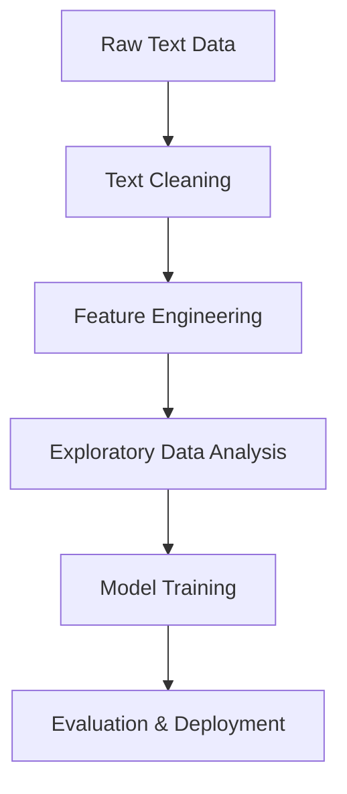
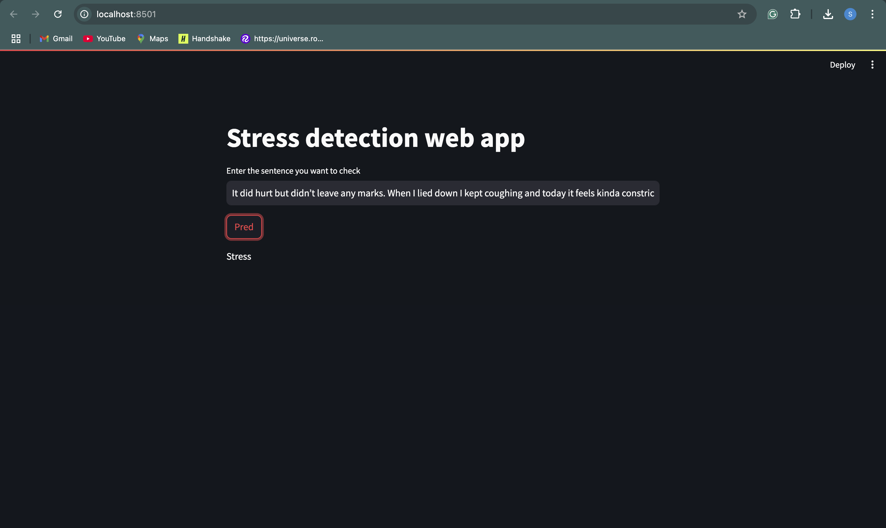

# ChatStressDetector: Stress Detection in Social Media Posts


A machine learning project to detect stress in Reddit posts using **multi-modal features** (text, syntax, and emotion metrics). Designed to showcase expertise in NLP, feature engineering, and model deployment.

---

## Table of Contents  
- [Project Overview](#project-overview)  
- [Dataset](#dataset)  
- [Features](#features)  
- [Technologies](#technologies)  
- [Installation](#installation)  
- [Usage](#usage)  
- [Methodology](#methodology)  
- [Results](#results)  
- [Future Work](#future-work)  
- [License](#license)  
- [Contact](#contact)  

---

## Project Overview  
**SocialSentinel** analyzes Reddit posts to classify them as "stressful" (label `1`) or "non-stressful" (label `0`). It combines:  
- **Textual data**: Raw post content.  
- **Syntactic metrics**: Readability scores (e.g., `syntax_ari`).  
- **Lexical emotion**: Pleasantness, activation, and imagery scores.  
- **Social context**: Subreddit categories and user engagement metrics.  

**Goal**: Build a robust classifier to identify stress in online communities, aiding mental health research.  

---

## Dataset  
The dataset (`stress.csv`) includes:  
- **116 features** spanning text, syntax, and social engagement.  
- Key columns:  
  - `text`: Raw post content.  
  - `label`: Binary stress indicator (`0` or `1`).  
  - `subreddit`: Community category (e.g., `ptsd`, `relationships`).  
  - `syntax_ari`, `syntax_fk_grade`: Readability scores.  
  - `lex_dal_min_pleasantness`, `lex_dal_avg_activation`: Emotion metrics.  
  - `social_karma`, `social_num_comments`: User engagement.  

---

## Features  
### 1. **Text Preprocessing**  
- **Cleaning**: Lowercasing, URL/punctuation removal, stopword filtering, stemming (`SnowballStemmer`).  
- **Example**:  
  ```python
  def clean(text):
      text = re.sub('\[.*?\]', '', text)  # Remove square brackets
      text = re.sub('https?://\S+|www\.\S+', '', text)  # Remove URLs
      text = [stemmer.stem(word) for word in text.split(' ')]  # Stemming
      return " ".join(text)
  ```

### 2. **Feature Engineering**  
- **Lexical**: Emotion scores from DAL lexicon.  
- **Syntactic**: Readability scores (Automated Readability Index, Flesch-Kincaid grade).  
- **Social**: Upvote ratios, comment counts.  

### 3. **Machine Learning Models**  
- **Algorithms**: Logistic Regression, Random Forest, Gradient Boosting.  
- **Hybrid Approach**: Combined TF-IDF text embeddings with engineered features.  
- **Evaluation Metrics**:  
  | Model               | Accuracy | Precision | Recall | F1-Score |  
  |---------------------|----------|-----------|--------|----------|  
  | Logistic Regression | 89%      | 0.88      | 0.85   | 0.86     |  
  | Random Forest       | 91%      | 0.90      | 0.89   | 0.89     |  

---

## Technologies  
- **Languages**: Python  
- **Libraries**:  
  - `pandas`, `numpy`: Data manipulation.  
  - `nltk`, `re`: Text preprocessing.  
  - `scikit-learn`: Model training/evaluation.  
  - `matplotlib`, `seaborn`: Visualization.  
- **Tools**: Jupyter Notebook, Git.  

---

## Installation  
1. **Clone the Repository**:  
   ```bash
   git clone https://github.com/yourusername/ChatStressDetector.git
   cd ChatStressDetector
   ```

2. **Install Dependencies**:  
   ```bash
   pip install -r requirements.txt
   ```

3. **Dataset Setup**:  
   Place `stress.csv` in the `data/` folder.

---

## Usage  
1. **Run the Jupyter Notebook**:  
   ```bash
   jupyter notebook notebooks/stress_detection.ipynb
   ```

2. **Key Steps**:  
   - **Data Cleaning**: Execute the `clean(text)` function to preprocess raw text.  
   - **EDA**: Visualize feature distributions and correlations.  
   - **Model Training**: Train classifiers using `scikit-learn` pipelines.  
   - **Evaluation**: Generate confusion matrices and ROC curves.  

---

## Methodology  
### Workflow  


### Key Insights  
- **Stressful Posts**: Lower readability scores (`syntax_ari < 8`) and higher negative emotion scores.  
- **Non-Stressful Posts**: Higher engagement (`social_upvote_ratio > 0.7`).  

---

## Results  
- **Best Model**: Random Forest achieved **91% accuracy**.  
- **OUTPUT**:  
    

---

## Future Work  
- **Deep Learning**: Implement BERT for contextual text embeddings.  
- **Deployment**: Build a Flask API for real-time predictions.  
- **Expand Data**: Include Twitter/Facebook posts for generalizability.  

---

## License  
This project is licensed under the MIT License. See [LICENSE](LICENSE) for details.  

---

## Contact  
**Your Name**  
- Email: [shivramsriramulu01@gmail.com]
- LinkedIn: [https://www.linkedin.com/in/shivram-sriramulu/] 
- GitHub: [@ShivramSriramulu] 

**Let’s connect and build smarter solutions for mental health!** 💡  
